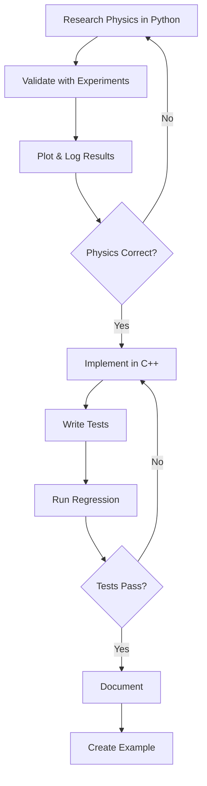

# REALIS Physics Engine

**Real-time, Engineered, Advanced Learning, Interactive Simulation**

A deterministic physics engine built on the principle: **Physics flows one way**

```
Python → Validation → C++ → Tests → Results
```

## Philosophy

REALIS is not just a physics engine—it's a disciplined approach to computational physics where:

- **Physics is discovered in Python** (physics_lab/)
- **Physics is enforced in C++** (engine/)
- **Physics is protected by tests** (tests/)
- **Physics is demonstrated in examples** (examples/)
- **Physics is documented in docs** (docs/)

### The One Law

**Never reverse the flow.** C++ never experiments. Python never guesses. Tests never compromise.

## Project Structure

```
REALIS/
│
├── docs/              # Engineering documentation
├── physics_lab/       # Python physics discovery 🔬
├── engine/            # C++ physics enforcement ⚙️
├── tests/             # Verification & regression 🧪
├── tools/             # Glue & helpers 🛠️
├── data/              # Truth storage 📊
├── examples/          # Demonstrations
└── build/             # Build artifacts
```

### physics_lab/ - Where Physics Starts 

Every physics concept begins here. Every experiment must:
- **Plot** its results
- **Log** energy and other conserved quantities
- **Reveal** instability if it exists

If physics is not proven here, it does not enter C++.

**Domains:**
- `core_math/` - Vectors, matrices, quaternions, units
- `kinematics/` - Point motion and trajectories
- `forces/` - Gravity, superposition, validation
- `rigid_body/` - Inertia, torque, angular dynamics
- `collisions/` - 1D, SAT, GJK algorithms
- `constraints/` - Pendulums, joints, drift analysis
- `integration/` - Euler, semi-implicit, Verlet, energy conservation
- `multibody/` - Articulated chains and systems
- `soft_body/` - Mass-spring, FEM
- `fluids/` - SPH, Navier-Stokes
- `thermo/` - Heat diffusion
- `electromagnetism/` - Field simulations

### engine/ - The Production Code

C++ implementation following validated physics. No experimentation, no guessing.

**Principles:**
- Deterministic only
- Fixed timestep only
- No plotting, no visualization
- Assumes physics is already correct

**Modules:**
- `math/` - Vector, matrix, quaternion primitives
- `core/` - World, timestep, integrator
- `dynamics/` - Rigid bodies, forces, inertia
- `collision/` - Broadphase, narrowphase, contact solver
- `constraints/` - Joints and constraint solvers
- `multibody/` - Articulated body dynamics (Featherstone)
- `softbody/` - Cloth and deformable bodies
- `fluids/` - SPH core implementation
- `energy/` - Energy monitoring and conservation
- `debug/` - Vector drawing and metrics
- `io/` - Scene loading and result writing

### tests/ - Truth Protection

Every bug gets a test before fixing. No regression allowed.

- `unit/` - Component-level tests
- `physics/` - Physics correctness tests
- `regression/` - Long-term stability tests

### tools/ - Integration Layer

Where Python meets C++, but nowhere else.

- `python_bindings/` - Python bindings to C++ engine
- `visualization/` - Debug viewers and plotters
- `converters/` - Data format converters

### data/ - Reproducible Truth

- `materials/` - Material properties database
- `scenes/` - Scene definitions
- `results/` - Simulation results (reproducible)

### examples/ - Living Demonstrations

If an example breaks, the engine has regressed.

- `falling_box/` - Basic dynamics
- `double_pendulum/` - Chaotic systems
- `cloth_drop/` - Soft body physics
- `water_splash/` - Fluid simulation

### docs/ - Engineering Discipline

A physics engine without documentation is not engineering.

- `assumptions.md` - Core assumptions and coordinate systems
- `validation.md` - Validation methodology
- `limitations.md` - Known limitations and boundaries
- `roadmap.md` - Development roadmap

## Quick Start

### Prerequisites

- Python 3.8+
- C++17 compiler (MSVC, GCC, or Clang)
- CMake 3.15+

### Running Physics Experiments

```bash
# Navigate to physics lab
cd physics_lab/kinematics

# Run an experiment
python point_motion.py
```

Every experiment will generate plots and energy logs.

### Building the C++ Engine

```bash
# Create build directory
mkdir build
cd build

# Configure and build
cmake ../engine
cmake --build .
```

### Running Tests

```bash
# From build directory
ctest
```

## Development Workflow



## Contributing

Before contributing:
1. Read `docs/assumptions.md` - Understand the foundation
2. Read `docs/validation.md` - Know how we validate
3. Follow the one-way flow - Python → C++ → Tests

## License

[To be determined]

## Contact

[To be determined]

---

**Remember:** Physics flows one way. Never reverse it.
