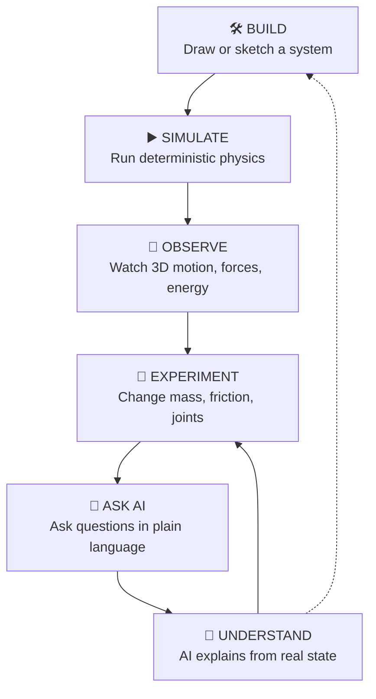
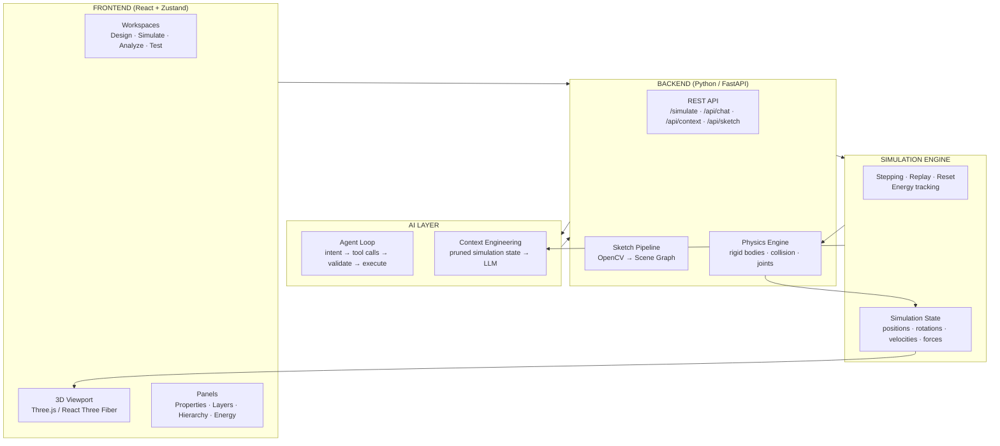
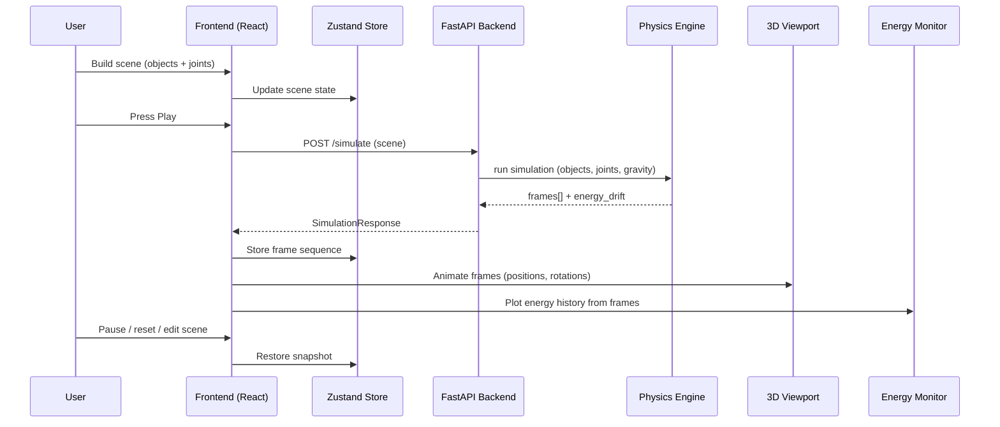
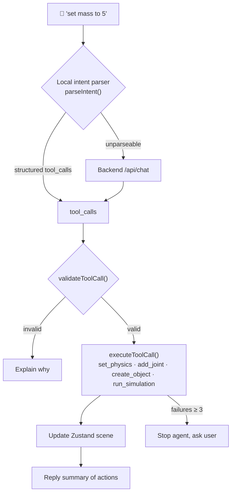
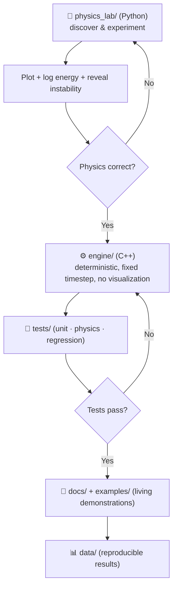
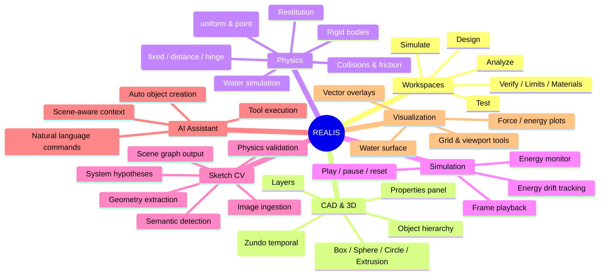

# Explaining REALIS

> **Real-time, Engineered, Advanced Learning, Interactive Simulation**

This document is for anyone who wants to understand REALIS — a short explanation, then diagrams of the architecture, data flows, and feature set.

---

## 1. What is REALIS?

**REALIS is an AI-powered interactive engineering and physics simulation platform.**

In one sentence:

> You draw (or sketch) a mechanical system, REALIS recognizes it, builds it as a 3D scene, runs a real physics simulation on it, lets you watch the forces and energy, and answers your questions about what is happening and why.

It combines five pillars:

| Pillar | What it does |
| --- | --- |
| **3D / CAD workspace** | Build scenes with boxes, spheres, circles, extrusions in an interactive Three.js viewport |
| **Physics engine** | Determinstic rigid-body dynamics, collisions, constraints, energy tracking (C++ core, Python runtime) |
| **Computer vision** | Turns hand-drawn sketches into a structured scene graph (OpenCV, fully local) |
| **Simulation engine** | Lifecycle, stepping, replay, energy monitoring, experiment control |
| **AI assistant** | Understands natural language ("make it static", "set mass to 5") and acts on the scene |

The guiding philosophy is a one-way physics discipline:

```
Python → Validation → C++ → Tests → Results
```

**Physics is discovered in Python, enforced in C++ (or a validated Python runtime), protected by tests.** The flow is never reversed.

---

## 2. The Core Product Loop

Everything in REALIS is designed around one loop — you build, simulate, observe, experiment, and ask the AI questions, then repeat.



---

## 3. System Architecture (Big Picture)

Three top-level layers — **Frontend**, **Backend**, and **AI** — all converge on the physics engine and simulation state.



**Single source of truth rule:** physics owns physical truth, the simulation engine owns simulation state, the frontend owns UI state, and the renderer only *visualizes* — it never invents physics.

---

## 4. How a Simulation Runs (Data Flow)



---

## 5. Sketch → Simulation (Computer Vision Pipeline)

A hand-drawn sketch becomes a working simulation through a 7-stage pipeline (all local OpenCV, no cloud APIs):

```mermaid
flowchart LR
    IN["✏️ Sketch or image<br/>+ optional prompt"] --> P1
    P1["Phase 1 · Ingest<br/>session + image"] --> P2["Phase 2 · Geometry<br/>Canny → contours → lines/circles/polygons"]
    P2 --> P3["Phase 3 · Semantics<br/>classify wheel/bob/block/rod"]
    P3 --> P4["Phase 4 · Relationships<br/>connected / touching / constrained"]
    P4 --> P5["Phase 5 · Hypotheses<br/>pendulum · pulley · car · bridge…"]
    P5 --> P6["Phase 6 · Intent fusion<br/>pick best system type"]
    P6 --> P7["Phase 7 · Scene Graph<br/>nodes + joints (hinge/distance/fixed)"]
    P7 --> PV["Phase 7.5 · Physics validation<br/>warnings · auto-fixes"]
    PV --> S3D["sketchToScene.js → 3D objects"]
    S3D --> SIM["▶️ Simulate + play back in viewport"]
```



Example interpretations: a bob on a rod becomes a **pendulum system**; two wheels under a box become a **car mechanism**; triangles on supports become a **bridge structure**.

---

## 6. AI Assistant (Agent Loop)

The AI turns plain language into validated actions on the scene. If a local rule parser can't understand the request, it falls back to the backend chat endpoint.



**Context engineering:** after each simulation, the backend stores a pruned, authoritative summary (object IDs, constraints, gravity, energy, drift, contacts) served at `/api/context` — so the AI reasons about *real simulation state*, not guesses.

---

## 7. Physics Discipline — How Physics Gets Built

The "one law": **physics flows one way.**



Domains validated in the physics lab: kinematics, forces, rigid body, collisions (SAT / GJK), constraints, integrators (Euler / semi-implicit / Verlet), multibody (Featherstone), soft body, fluids (SPH), thermo, electromagnetism.

---

## 8. Feature Map



---

## 9. Quick "Explain It to Me" Script

> REALIS is a physics lab that runs in your browser. You can draw a system on a canvas — a pendulum, a car, a bridge — and REALIS uses computer vision to understand your sketch and turn it into a 3D scene. It then runs an actual physics simulation: rigid bodies, collisions, friction, joints, gravity. While it runs you watch the motion in a 3D viewport, see force vectors and energy graphs, and change properties like mass or bounciness. You can also just type "make it static" or "set friction to 0.8" and the built-in AI assistant does it for you. Underneath, there's a disciplined pipeline — physics is first validated in Python experiments, then implemented in a deterministic engine, and protected by tests, so the simulation you watch is trustworthy, not faked.
